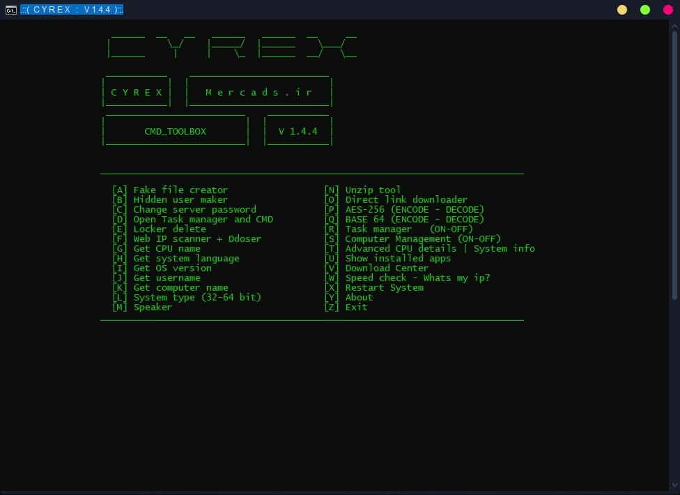

```
 _______ __   __  ______ _______ _     _
 |         \_/   |_____/ |______  \___/ 
 |_____     |    |    \_ |______ _/   \_
```
# Cyrex is a server management tool :)


# Batch-Script

* This tool coded in batch-script, and the `.BAT` version does not work without converting to `.EXE`
* you can download `BAT TO EXE CONVERTER` [Here](https://bat-to-exe-converter-x64.en.softonic.com/?ex=THD-324.3)
* Report all bugs and new ideas here : [Telegram](https://t.me/l27_0_0_l)
